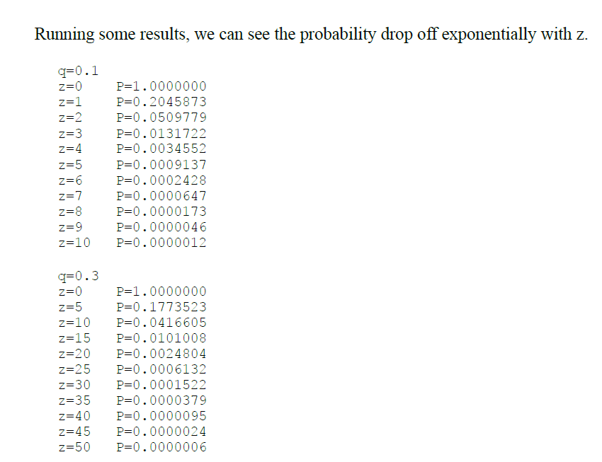

## ataque_satoshi_poisson

Calcular a probabilidade de sucesso de um atacante em reverter transações em uma blockchain, conforme paper de Satoshi Nakamoto.

##  Attacker Success Probability in Blockchain (Gambler’s Ruin Model)

Este repositório implementa, em linguagem C++, a função que estima a **probabilidade de sucesso de um atacante** tentando reverter uma transação já incluída na blockchain, utilizando o modelo estatístico descrito no white paper de Satoshi Nakamoto (Bitcoin: A Peer-to-Peer Electronic Cash System, 2008).

---

##  Contexto Teórico

O cálculo baseia-se no modelo de **Caminhada Aleatória Binomial** e no problema estatístico conhecido como **Gambler’s Ruin**. 

Nele, o atacante tenta construir uma cadeia de blocos alternativa e inválida mais rapidamente que a cadeia honesta, visando substituir uma transação legítima por outra fraudulenta (por exemplo, um gasto duplo).

- **p**: probabilidade de a rede honesta encontrar o próximo bloco  
- **q**: probabilidade de o atacante encontrar o próximo bloco  
- **z**: número de blocos de confirmação após a transação original  
- **λ (lambda)**: valor esperado da distribuição de Poisson para o progresso do atacante  
- A fórmula calcula a chance de o atacante alcançar ou ultrapassar a cadeia honesta em algum ponto após `z` blocos de vantagem da rede honesta.
- Na imagem, o valor q = 0.1 refere-se à probabilidade do atacante encontrar o próximo bloco da cadeia de blocos (blockchain).
- Esse número, 0.1 (ou 10%), significa que o atacante tem uma chance de 10% de sucesso a cada tentativa de encontrar um bloco antes da rede honesta.
- Portanto, q = 0.1 indica que o atacante possui 10% do poder de mineração da rede (hashrate), enquanto a rede honesta (representada por p) tem os outros 90% (ou seja, p = 1 - q = 0.9).
  
## Ao analisarmos alguns resultados, podemos observar que a probabilidade diminui exponencialmente com o aumento de z.

You can reach me at rmilhomem[at]gmail[dot]com or connect on [LinkedIn](https://www.linkedin.com/in/rodolfo-space-force/) for collaborations.

## Licença

Este projeto está licenciado sob a Licença MIT. Você pode usar, modificar e redistribuir este código livremente, desde que mencione o autor original.

